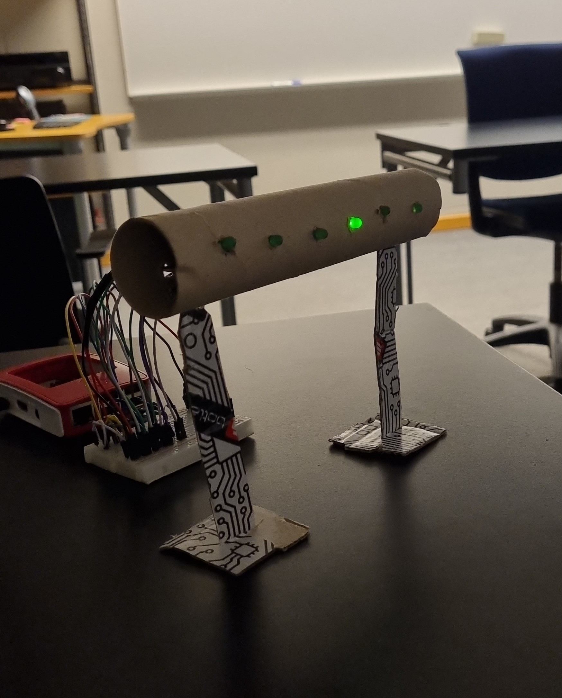
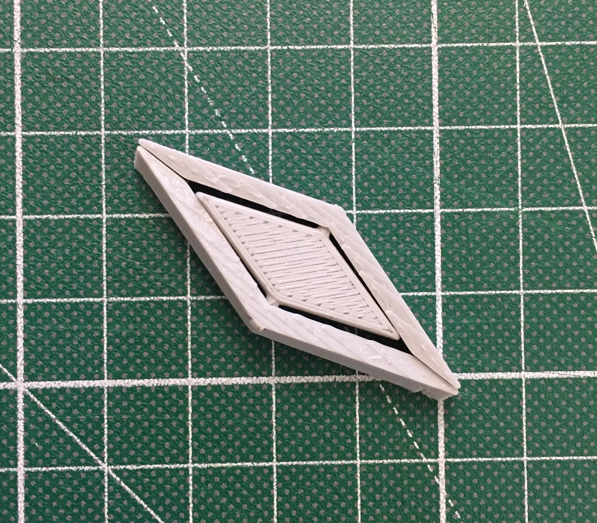
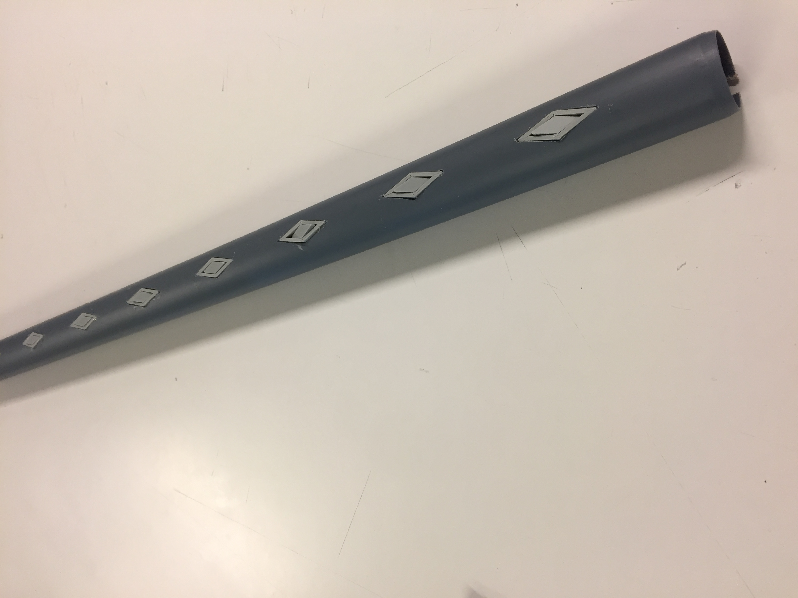
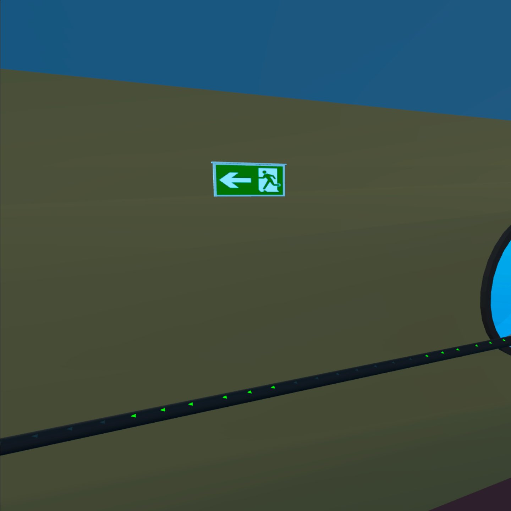
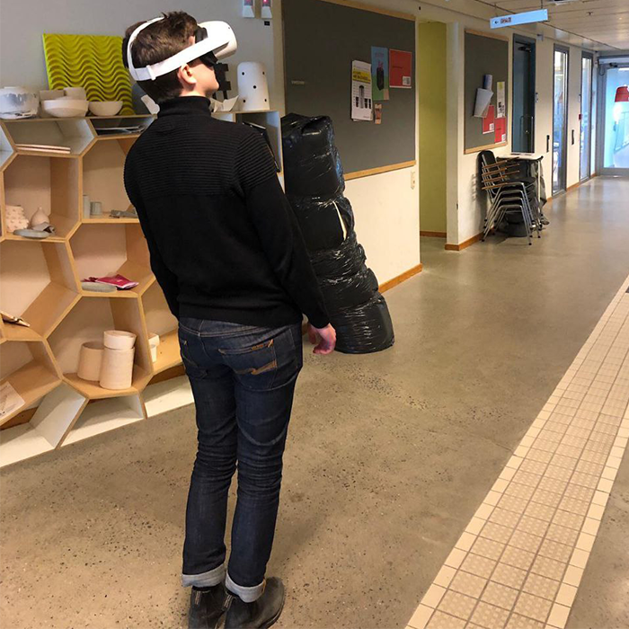
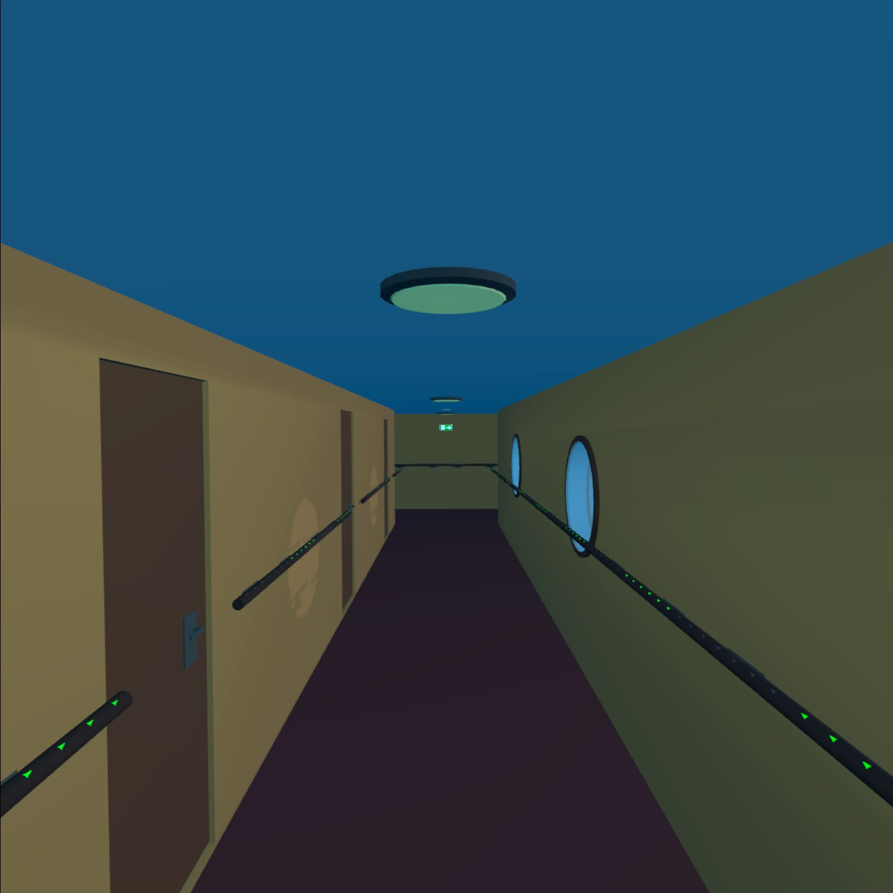
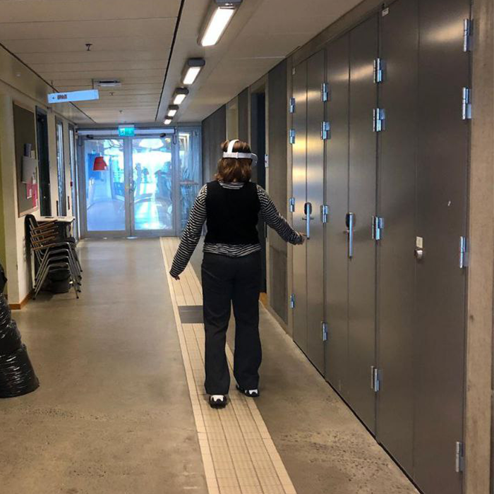
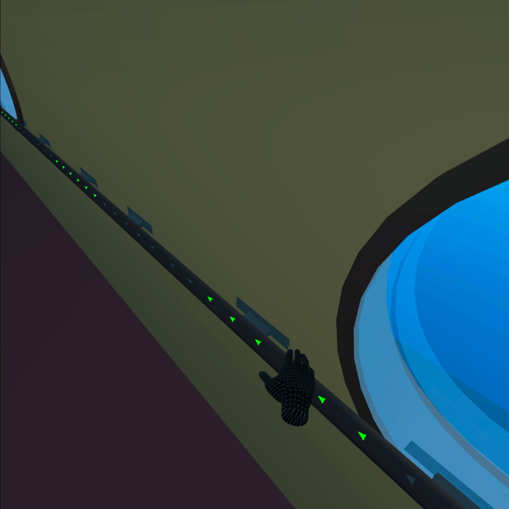

# Using VR as a way to present your high-fidelity prototype 

**This repository contains 3D Blender models and Unity project that combined create a VR environment of a cruise ship corridor. This is just a part of a bigger group project done for the Universal Design course at _Lund University_.**

### Meet the group
- Linnea Petzold
- [Lisa Christiansson](https://www.linkedin.com/in/lisa-christiansson-7a4681174/)
- [Yiyang Liu](https://github.com/Vincent-Liu87)
- [Jakub Olejnik](https://www.linkedin.com/in/jakub-olejnik-85a686203/) *(That's me!)*

## About the project
The goal of the project was to come up with an inclusive way to convey safety information during a cruise. Our idea was to create handrails that will inform passengers both in a 
tactile and visual way of the evacuation route direction. Most of the emergency exit 
signs are static and cannot be changed during those emergencies. We wanted to address
that by designing our handrail to be able to easily adapt and change depending on the
situation on the escape route, eg. if an adjacent corridor is on fire, we want to direct
passengers to a different, safer route.

 
    
    
    

## VR simulation
We imagined an inclusive environment where important information is distributed and
conveyed in a more diverse yet subtle way. We wanted to convey functionality of the rails
and how people interact with the new environment in an easy and simple way for people to
understand. Putting a person inside an interactive simulation with a 3D environment
allowed us to do so. They’re placed inside a ship’s corridor and experience what it is
like to be in the middle of an emergency situation on a ship equipped with our handrail
prototype.

    
     
    
    
     
    
    

